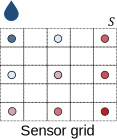
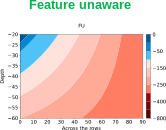
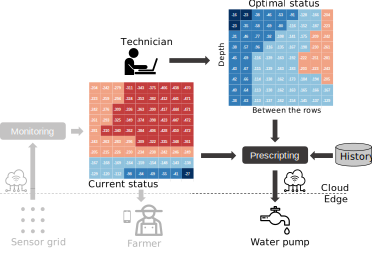

# Hi!



Matteo Francia

- Assistant professor at DISI - University of Bologna
- Contact: m.francia@unibo.it

Main background:

- Ph.D. in *Computer Science and Engineering*
- Big data and machine learning
- ... with *applications* to the field of Precision Agriculture

These slides are the result of a shared effort, many thanks to:

- Prof. Matteo Golfarelli, Dott. Manuele Pasini, Dott. Alex Baiardi

Patent: 

- "METODO E SISTEMA PER IL MONITORAGGIO DELL'UMIDITÀ DEL SUOLO" registered on October 18, 2023 N. 102021000023162

# Smart Irrigation

:::: {.columns}
::: {.column width="60%"}

The synergy of internet of things (IoT) and precision farming is producing valuable applications in the Agritech domain [@vitali2021crop]

- **Agritech**: use of technology for farming to improve efficiency and profitability

Optimizing soil moisture is crucial for watering and crop performance [@turkeltaub2016real]

- **GOAL**: saving water while improving fruit quality (i.e., provide a recommendation of the amount necessary water)
- *Soils* have different water retention
- *Watering systems* have different behaviors
    - Drippers vs sprinklers
- *Plants* have different water demand
    - Kiwi [@judd1986water] vs Grapes
- *Sensors* produce different measurements with different precisions

:::
::: {.column width="40%"}

</img>

:::
::::

# Reference Scenario

:::: {.columns}
::: {.column width="58%"}

:::
::: {.column width="42%"}

:::
::::

Our approach focuses on (Kiwi) orchards

- Kiwi *plants are aligned along rows*
- Each row has many *drippers* (e.g., 1 every 60cm)
- Drippers can water a *limited soil volume*

# Digital Transformation {visibility="hidden"}

# Digital Transformation {visibility="hidden"}

:::: {.columns}
::: {.column width="60%"}

(Example) Scenarios of digital transformation in agriculture

- *Scenario #1*
    - The farmer/technician controls the watering system based only on the experience
    - No digital data/KPIs/automation
- *Scenario #2*
    - The control of the watering system is refined by observing sensor data
    - Sensor data is digitalized, no automation
- *Scenario #3*
    - A decision support system that, knowing how to optimize KPIs, controls the watering system
    - Sensor data is digitalized, automatic KPIs and action

:::
::: {.column width="40%"}

:::
::::

# Digital Transformation and AI {visibility="hidden"}

:::: {.columns}
::: {.column width="60%"}

(Example) Scenarios of digital transformation in agriculture

- *Scenario #1*
    - The farmer/technician controls the watering system based only on the experience
    - No digital data/KPIs/automation
- *Scenario #2*
    - The control of the watering system is refined by observing sensor data
    - Sensor data is digitalized, no automation
- *Scenario #3*
    - A decision support system that, knowing how to optimize KPIs, controls the watering system
    - Sensor data is digitalized, automatic KPIs and action

:::
::: {.column width="40%"}

:::
::::

# Simulators... {visibility="hidden"}

To achieve our goal, *it is necessary to understand of the soil behaves*

Simulate the soil behavior according to physical models [@van1980closed]

- However a fine-tuning is required, we need to know/parametrize everything
    - *Soil* (e.g., retention curve, hysteresis [@pham2005study])
    - *Plant* (e.g., roots, LAI)
    - *Weather* conditions (temperature, humidity, wind, precipitations)
    - *Watering* system (e.g., capacity, distance between drippers)
- Tuning can take months (of human interactions)!
    - Need to collect samples from the field... if some parameter is incorrect we need to trace back
    - Need to implement/code all physical features into the simulator
        - E.g., [@vsimunek2012hydrus] implemented in [@bittelli2015soil]
    - Hyper-parameter tuning with machine learning can help, but it is not a silver bullet

# ... vs Sensors {visibility="hidden"}

:::: {.columns}
::: {.column width="32%"}

![[@koyuncu2021construction]](https://github.com/user-attachments/assets/34d873c7-cef3-40ff-96b7-a8a7cde01d3e)

:::
::: {.column width="32%"}

![[@zheng2009spatial]](https://github.com/user-attachments/assets/35bd797c-6d1a-469b-9334-dbfdbea1107e)

:::
::: {.column width="32%"}

![[@fersch2018synergies]](https://github.com/user-attachments/assets/a87b3e8e-6afc-451a-b971-9e31052b71d3)

:::
::::

# {visibility="hidden"}

# Open Field vs Simulator {visibility="hidden"}

# Overview of the Approach 

:::: {.columns}
::: {.column width="50%"}

Our approach is composed of two phases

- **Monitoring**: understand the soil behavior
- **Prescripting**: provide the optimal amount of water

... involves two actors

- *Farmer*: provides knowledge about the field and daily feedbacks
- *Technician*: defines the optimal status and checks the system's behavior

... and requires an IoT environment

- *Sensors* (mandatory): provide real-time knowledge
- *Actionable water pump*: enables the smart irrigation
    - Without a remote connection, we provide the farmer a recommendation about the irrigation (e.g., via e-mail)

:::
::: {.column width="50%"}

:::
::::

# Monitoring

# From Sensors to Soil Profiles

:::: {.columns}
::: {.column width="32%"}

:::
::: {.column width="32%"}

:::
::: {.column width="32%"}

:::
::::

See [@francia2022multi]

1. Soil moisture is a continuum in the soil
1. Sensors return a discretized representation of soil moisture
    - Depending on the number of sensors and on their layout the monitoring accuracy changes
1. Goal: produce fine-grained soil profiles out of coarse-grained layouts

# Sensor Layouts and Symmetry Assumptions

Competitors rely on a single sensor (or a line of sensors at different depths) and assume that the soil moisture is uniform everywhere 

:::: {.columns}
::: {.column width="50%"}

:::
::: {.column width="50%"}

:::
::::

- If the watered volume is symmetric along the row, a 2D sensor grid is sufficient to represent the soil volume
- If moisture variations take place along the row too, a 3D grid of sensors is required
    - E.g., too sparse drippers

# Overview

# Data Collection

:::: {.columns}
::: {.column width="60%"}

Setup

- We install a 2D/3D grid of sensors

For instance, in the 2D setting 

- 4 columns of sensors are located across the row (e.g., 0/30/60/90cm)
    - The column (0, *) is under the dripper
- Each column has 3 sensors located at 3 depths (e.g., 20/40/60cm)

Dataset

- *In two years, we collected 16GB of data (as of 2022-08-30)*
- *In four years, we collected 64GB of data (as of 2024-08-30)*

:::
::: {.column width="40%"}

:::
::::

# Data Collection {visibility="hidden"}

In the 2D setting (3 x 4 gypsum block sensors)

- Sample soil moisture-sensor data every 15 minutes
- Collect dripper and weather data  (humidity, temperature, solar radiation, wind) every hour

How much data does each monitored field produce every season?

$(12 \cdot 4 \frac{𝑠𝑎𝑚𝑝𝑙𝑒𝑠}{ℎ𝑜𝑢𝑟}+5 \frac{𝑠𝑎𝑚𝑝𝑙𝑒𝑠}{ℎ𝑜𝑢𝑟}) \cdot 24 \frac{ℎ𝑜𝑢𝑟}{𝑑𝑎𝑦} \cdot 30 \frac{𝑑𝑎𝑦}{𝑚𝑜𝑛𝑡ℎ} \cdot 5 \frac{𝑚𝑜𝑛𝑡ℎ}{𝑦𝑒𝑎𝑟} = 200 \cdot 10^3 \frac{𝑠𝑎𝑚𝑝𝑙𝑒𝑠}{𝑦𝑒𝑎𝑟}$

We monitored 6 fields for 2 years

$(200 \cdot 10^3 \frac{𝑠𝑎𝑚𝑝𝑙𝑒𝑠}{𝑦𝑒𝑎𝑟} \cdot 2 𝑦𝑒𝑎𝑟) \cdot 6= 2.4 \cdot 10^6 𝑠𝑎𝑚𝑝𝑙𝑒𝑠$

We should consider accessory data for storage and optimization structures

Dataset

- *In two years, we collected 16GB of data (as of 2022-08-30)*
- *In four years, we collected 64GB of data (as of 2024-08-30)*

# Processing

:::: {.columns}
::: {.column width="60%"}

**Feature unaware (FU)**

- Plug-and-play 
- Create a linear interpolation of the real-time sensor data

**Feature aware (FA)**

- Require time for data collection and training/testing
- Create an interpolation of the real-time sensor data through machine learning

:::
::: {.column width="40%"}

:::
::::

# Online Phase: Feature-Unaware Profiling

Profile real-time sensor data through **statistical techniques**

- Plug-and-play 
- Create a linear interpolation of the real-time sensor data

# Offline Phase: Feature-Aware Profiling

:::: {.columns}
::: {.column width="60%"}

Profile real-time sensor data through a **machine learning model**

In the *offline pipeline*, we train the model given the soil texture as input...

- Simulate different patterns of SM to produce a dataset of simulated SM
- Train a machine learning model on such data
- Deploy the model to estimate the soil profile

:::
::: {.column width="40%"}

:::
::::

# Feature Aware: Crop Simulator

Data generation and augmentation

- **CRITERIA 3D** [@bittelli2011criteria] to simulate the hydrological fluxes in the soil following Richard’s equations
- Inputs
    - The *soil texture*
    - "Default" settings for the *kiwi-plant* (e.g., the shape of the tree roots / LAI)
    - *Watering system* based on a single dripper
    - *Weather conditions* from ARPAE
    - Different *watering patterns* (by changing watering intervals and the amount of supplied water)
- Output
    - *Training set* = $12 \frac{𝑠𝑎𝑚𝑝𝑙𝑒𝑠}{ℎ𝑜𝑢𝑟} \cdot 24 \frac{ℎ𝑜𝑢𝑟}{𝑑𝑎𝑦} \cdot 30 \frac{𝑑𝑎𝑦}{𝑚𝑜𝑛𝑡ℎ} \cdot 4 months = 35 \cdot 10^3 samples$
    - *Validation set* = same as training set, but we simulate with different weather/irrigation patterns
    - *Test set* = 4 months from the real field
- Different weather conditions & watering patterns to enable generalization and avoid overfitting

# Feature Aware: Machine Learning

This is a **(multi-output) regression problem**

- The task is to *learn the function mapping the input to the continuous output*
- We tried several machine learning models
    - SVR, Random Forest Regression, Linear Regression, and ANN
    - *(A simple) ANN is the best performing model*

# Artificial Neural Networks

The hyperparameters (structure/learning rates) are set through a hyper-parameter tuning process

- *HyperOpt* [@komer2019hyperopt]: state-of-the-art optimization technique to explore the huge search space of hyper-parameters

# Artificial Neural Networks

# Feature Aware vs Unaware

:::: {.columns}
::: {.column width="50%"}

:::
::: {.column width="50%"}

:::
::::

# Evaluation

:::: {.columns}
::: {.column width="50%"}

Feature-unaware and feature-aware profiling **are complementary**

- *Feature-unaware* profiling allows the system to operate as soon as we have the sensors ready
    - It requires more sensors to be accurate since it assume that soil-moisture behaves linearly in the soil
    - However, we cannot have too many sensors due to their economic costs or space constraints
- *Feature-aware* profiling is more precise and can operate with any layout of sensors
    - However, it requires weeks of data to tune the simulator

:::
::: {.column width="50%"}

:::
::::

# Evaluation {visibility="hidden"}

If I got 4 sensors, what layout should I choose?

# Evaluation {visibility="hidden"}

If I got 4 sensors, what layout should I choose?

:::: {.columns}
::: {.column width="50%"}

:::
::: {.column width="50%"}

:::
::::

# Serving the Data {visibility="hidden"}

# Descriptive Analytics {visibility="hidden"}

Starting from the profile, we derive meaningful visualizations/analysis

- SM variance (left; lighter areas are those where SM varies the most) and average (right)

The charts support both agricultural technicians and farmers

- What is the watered volume? 
    - This region is typically characterized by watering and high suction by the roots 
    - Over-watering: high values in the average chart and low values in the variance chart
- Where is the root suction higher?
    - A high root suction quickly reduces the moisture in the soil and results in high soil moisture variance
- How do soil moisture dynamics impact the watered volume?
    - If, after increasing the water supplied, the profile does not change then the soil disperses water

# Prescripting

# Prescripting

The technician sets an optimal soil moisture and the system must reach it

:::: {.columns}
::: {.column width="50%"}

:::
::: {.column width="50%"}

- **Red**: optimal state
- *Blue*: current state

:::
::::

# Watering Advice (2021-2022) [@quartieri2021effect]

:::: {.columns}
::: {.column width="50%"}

Given the following algorithm

    IF
        ((#BlueCells + #LightBlueCells)/(#Cells) < 0.50 &&
        (#BlueCells)/(#Cells) < 0.25 in the last 12h) &&
        precipitations < 7mm in the last 12h
    THEN 
        Recommended water = Evapotranspiration (ET) of the day before
    ELSE 
        Do nothing

We provide advice (recommendations) to technicians, who use (and adjust) the advice according to their experience.

- *Pro*: it relies on the experience of the technician
- *Con*:
  - can be stuck in sub-optimal irrigations (e.g., the system never converges to the optimal scenario) and requires human intervention
  - does not scale out to many fields; controlling 6 fields already entails a lot of work

:::
::: {.column width="50%"}

:::
::::

# Automated Watering (2023-2024)

**PID**, a control loop mechanism employing feedback

- Calculates an error $e(t)$ as the difference between a desired setpoint (SP) and a measured process variable (PV)
    - $e(t) = r(t) - y(t)$
- Applies a correction based on *proportional*, *integral*, and *derivative* terms

# 

Correction is based on 3 terms: $u(t)=K_{p}e(t)+K_{i}\int_{0}^{t} e(\tau)\mathrm{d}\tau + K_{d}{\frac{\mathrm{d}e(t)}{\mathrm{d}t}}$

- **P**: proportional to the *current value* of the $SP − PV$ error $e(t)$
- **I**: integrates the *past values* of $e(t)$ over time to eliminate the residual error
    - Ensures that even small, persistent errors are eventually corrected
        - Imagine that the desired soil moisture is 60%, but the system is stuck at 57%
        - P (alone) might not be strong enough to bring the system to exactly 60%, leaving a small steady-state error
- **D**: estimate of *the future trend* of $e(t)$ based on its current rate of change
    - Adds stability to the system by damping the response and reducing oscillations
    - Acts like a brake, slowing down the response as the system nears the SP
- $K_p, K_i, K_d$ are non-negative coefficients for the proportional, integral, and derivative terms respectively
    - A higher $K_p$​ reduces the error faster but may lead to overshoot (going past the desired SP)
    - Constants are initially entered knowing the type of application and tuned by observing the system response

# Test Setup

Two irrigation setups during the 2021-2024 campaigns (i.e., May/October) within the same orchard

- *Control Row (T0)*: irrigation is manually controlled by the farmer
- *Managed Row (T1 and T2)*: irrigation is automatically controlled using a 2D installation of 12 sensor

:::: {.columns}
::: {.column width="33%"}

**T0** (single wing)

:::
::: {.column width="33%"}

**T1** (single wing)

 

:::
::: {.column width="33%"}

**T2** (double wing)

:::
::::

# Water consumption

:::: {.columns}
::: {.column width="60%"}

<table border="1" class="dataframe">
  <thead>
    <tr>
      <th></th>
      <th></th>
      <th colspan="3" halign="left">Irrigation volume ($\frac{m^3}{ha}$)</th>
      <th colspan="2" halign="left">Performance</th>
    </tr>
    <tr>
      <th></th>
      <th>Row</th>
      <th>T0</th>
      <th>T1</th>
      <th>T2</th>
      <th>T1</th>
      <th>T2</th>
    </tr>
    <tr>
      <th>Field</th>
      <th>Year</th>
      <th></th>
      <th></th>
      <th></th>
      <th></th>
      <th></th>
    </tr>
  </thead>
  <tbody>
    <tr>
      <th rowspan="3" valign="top">C1</th>
      <th>2021</th>
      <td>*3790*</td>
      <td>2112</td>
      <td>3382</td>
      <td>**-44%**</td>
      <td>-11%</td>
    </tr>
    <tr>
      <th>2022</th>
      <td>*3059*</td>
      <td>2300</td>
      <td>3420</td>
      <td>**-25%**</td>
      <td>+12%</td>
    </tr>
    <tr>
      <th>2023</th>
      <td>*3595*</td>
      <td>2256</td>
      <td>4453</td>
      <td>**-37%**</td>
      <td>+24%</td>
    </tr>
  </tbody>
</table>

:::
::: {.column width="38%"}

Fruit quality results are discussed in [@quartieri2021effect] and [@baldi2023smart]

:::
::::

# Fruit quality {visibility="hidden"}

<table border="1" class="dataframe">
  <thead>
    <tr>
      <th></th>
      <th></th>
      <th colspan="3" halign="left">Color (H angle)</th>
      <th colspan="3" halign="left">Dry mass (%)</th>
      <th colspan="3" halign="left">Hardness (kg)</th>
      <th colspan="3" halign="left">RSR (° brix)</th>
      <th colspan="3" halign="left">Weight (g)</th>
    </tr>
    <tr>
      <th></th>
      <th>Row</th>
      <th>T0</th>
      <th>T1</th>
      <th>T2</th>
      <th>T0</th>
      <th>T1</th>
      <th>T2</th>
      <th>T0</th>
      <th>T1</th>
      <th>T2</th>
      <th>T0</th>
      <th>T1</th>
      <th>T2</th>
      <th>T0</th>
      <th>T1</th>
      <th>T2</th>
    </tr>
    <tr>
      <th>Field</th>
      <th>Year</th>
      <th></th>
      <th></th>
      <th></th>
      <th></th>
      <th></th>
      <th></th>
      <th></th>
      <th></th>
      <th></th>
      <th></th>
      <th></th>
      <th></th>
      <th></th>
      <th></th>
      <th></th>
    </tr>
  </thead>
  <tbody>
    <tr>
      <th rowspan="3" valign="top">C1</th>
      <th>2021</th>
      <td>105.0</td>
      <td>102.0</td>
      <td>103.0</td>
      <td>17.2</td>
      <td>18.4</td>
      <td>18.8</td>
      <td>4.07</td>
      <td>3.15</td>
      <td>4.05</td>
      <td>12.7</td>
      <td>15.3</td>
      <td>13.7</td>
      <td>116.0</td>
      <td>116.0</td>
      <td>107.0</td>
    </tr>
    <tr>
      <th>2022</th>
      <td>104.0</td>
      <td>103.0</td>
      <td>105.0</td>
      <td>18.6</td>
      <td>18.9</td>
      <td>17.8</td>
      <td>5.20</td>
      <td>4.70</td>
      <td>4.80</td>
      <td>10.5</td>
      <td>11.7</td>
      <td>8.9</td>
      <td>117.0</td>
      <td>122.0</td>
      <td>119.0</td>
    </tr>
    <tr>
      <th>2023</th>
      <td>104.6</td>
      <td>102.9</td>
      <td>104.9</td>
      <td>17.4</td>
      <td>18.2</td>
      <td>17.2</td>
      <td>5.50</td>
      <td>5.20</td>
      <td>5.61</td>
      <td>10.1</td>
      <td>11.6</td>
      <td>8.8</td>
      <td>143.0</td>
      <td>143.0</td>
      <td>155.0</td>
    </tr>
  </tbody>
</table>

# Results 

:::: {.columns}
::: {.column width="66%"}

**Uncountable**:

- Crop sustainability & smaller environmental footprint

**Countable**:

- Faster and more dynamic intervention in the control of irrigation
- More accurate approximation of soil dynamics

**Money**:

- *Fewer management issues*
- *Smaller irrigation amount*
    - MR saved 44% of water during the whole campaign
    - Max. saving in Jun and Sep: for the farmer, it is harder to estimate water demand
- *Comparable (or even better) quality of the product*; e.g. in 2021:
    - Productivity of vines was unaffected by irrigation (32-39 kg/vine; 35-44 t/ha)
    - CR's fruits appeared greener (H angle 105) than fruits from MR (H angle 102)
    - CR's fruits solid concentration (12.7 brix) < MR's fruits (15.3 brix)
        - Gap maintained after 2 months of storage (and 1 day of shelf life) 
        - 17.4 brix for MR vs 16.1 brix for CR
:::
::: {.column width="34%"}

|                                       | T0        | T1        |
|------------------                     |----       |----       |
| Surface ($ha$)                        | 5        | 5        |
| Pump consumption (KWh)                | 10        | 10        |
| Cost KWh                              | 0.5€      | 0.5€      |
| Irrigation volume ($\frac{m^3}{ha}$)  | 3790     | 2112      |
| \#Drippers 4$\frac{l}{h}$ (per $ha$)  | 3344      | 3344      |
| Water consumption ($\frac{m^3}{h}$)   | 14        | 14        |
| Pump working hours ($\frac{h}{ha}$)   | 274       | 157       |
| *Energy costs*                        | **6850€** | **3925€** |

:::
::::

# Future direction: soil moisture profiling {visibility="hidden"}

Continual learning to overcome the limitations of the simulation

- Adapting the model after its deployment
- Use the data that is coming into the production environment and retrain the model-based 
- Fit to unforeseen field conditions

Improving the recommendation

- Sometimes the soil does not behave as expected

Homogeneous water recommendation; however, we need to handle:

- The "water needs" of the plant
- The phenological growth stages
- Field conditions
- Latitude/longitude
- Availability of water

# Future direction: forecasting

**Remote observations**

- How can we integrate in-situ soil profiles with satellite observations?

**Forecasting**

- While profiling looks at the current state of soil moisture, how will soil moisture change --- for instance --- in a week?
    - Soil profiles are snapshots of soil moisture, we should learn from a time series of snapshots 
    - Features to consider
        - Soil conditions
        - Weather conditions
        - Type of irrigation

# Future direction: unifying data platform {visibility="hidden"}

:::: {.columns}
::: {.column width="50%"}

Soil monitoring is a possible application of data platforms for precision farming

- Robotics, tractors, and implements
- Satellite images and remote sensing indexes
- Spatio-temporal analysis
- And many others!

Research issues

- Shared dictionary. Many sub-domains of precision agriculture, each with its dictionary
- Data integration. We need a common layer (storage+processing) to access data sources
- Heterogeneous analytics. Data have multiple natures, spatial and temporal data require ad-hoc techniques 

:::
::: {.column width="50%"}

:::
::::

# References