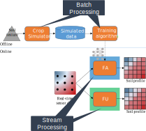
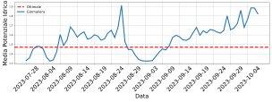

# Hi!

Matteo Francia

- Assistant professor at DISI - University of Bologna
- Contact: m.francia@unibo.it

Main background:

- Ph.D. in *Computer Science and Engineering*
- Big data and machine learning
- ... with *applications* to the field of Precision Agriculture
- *Interdisciplanarity* is very important!

These slides are the result of a shared effort, many thanks to:

- Prof. Matteo Golfarelli, Dott. Manuele Pasini, Dott. Alex Baiardi

Patent: 

- "METODO E SISTEMA PER IL MONITORAGGIO DELL'UMIDITÀ DEL SUOLO" registered on October 18, 2023 N. 102021000023162

# Smart Irrigation

:::: {.columns}
::: {.column width="62%"}

The synergy of internet of things (IoT) and precision farming is producing valuable applications in the Agritech domain [@vitali2021crop]

- **Agritech**: use of technology for farming to improve efficiency & profitability

Optimizing soil moisture is crucial for watering and crop performance [@turkeltaub2016real]

**GOAL**

- Saving water while improving fruit quality (i.e., provide a recommendation of the amount necessary water)

Problems:

- *Soils* have different water retention
- *Watering systems* have different behaviors
    - Drippers vs sprinklers
- *Plants* have different water demand
    - Kiwi [@judd1986water] vs Grapes
- *Sensors* produce different measurements with different precisions

:::
::: {.column width="33%"}

</img>

:::
::::

# Reference Scenario

:::: {.columns}
::: {.column width="58%"}

:::
::: {.column width="42%"}

:::
::::

Our approach focuses on (Kiwi) orchards

- Kiwi *plants are aligned along rows*
- Each row has many *drippers* (e.g., 1 every 60cm)
- Drippers can water a *limited soil volume*

# Overview of the Approach 

:::: {.columns}
::: {.column width="50%"}

Our approach is composed of two phases

- **Monitoring**: understand the soil behavior
- **Prescripting**: provide the optimal amount of water

... involves two actors

- *Farmer*: provides knowledge about the field and daily feedbacks
- *Technician*: defines the optimal status and checks the system's behavior

... and requires an IoT environment

- *Sensors* (mandatory): provide real-time knowledge
- *Actionable water pump*: enables the smart irrigation
    - Without a remote connection, we provide the farmer a recommendation about the irrigation (e.g., via e-mail)

:::
::: {.column width="50%"}

:::
::::

# Monitoring

# From Sensors to Soil Profiles

:::: {.columns}
::: {.column width="32%"}

:::
::: {.column width="32%"}

:::
::: {.column width="32%"}

:::
::::

See [@francia2022multi]

1. Soil moisture is a continuum in the soil
1. Sensors return a discretized representation of soil moisture
    - Depending on the number of sensors and on their layout the monitoring accuracy changes
1. Goal: produce fine-grained soil profiles out of coarse-grained layouts

# Sensor Layouts and Symmetry Assumptions

Competitors rely on a single sensor (or a line of sensors at different depths) and assume that the soil moisture is uniform everywhere 

:::: {.columns}
::: {.column width="50%"}

:::
::: {.column width="50%"}

:::
::::

- If the watered volume is symmetric along the row, a 2D sensor grid is sufficient to represent the soil volume
- If moisture variations take place along the row too, a 3D grid of sensors is required
    - E.g., too sparse drippers

# Overview

- **Online**: compute soil profiles as soon as new data arrives
- **Offline**: refine the profiling function through *machine learning*

# Data Collection

:::: {.columns}
::: {.column width="60%"}

Setup

- We install a 2D/3D grid of sensors

For instance, in the 2D setting 

- 4 columns of sensors are located across the row (e.g., 0/30/60/90cm)
    - The column (0, *) is under the dripper
- Each column has 3 sensors located at 3 depths (e.g., 20/40/60cm)

Dataset

- *In two years, we collected 16GB of data (as of 2022-08-30)*
- *In four years, we collected 64GB of data (as of 2024-08-30)*

:::
::: {.column width="40%"}

:::
::::

# Processing

:::: {.columns}
::: {.column width="60%"}

**Feature unaware (FU)**

- Linear interpolation of the real-time sensor data
- Plug-and-play (working since day 0)

**Feature aware (FA)**

- Interpolation of the real-time sensor data through machine learning
- Requires time for data collection and training/testing

:::
::: {.column width="40%"}

:::
::::

# Online Phase: Feature-Unaware Profiling

Profile real-time sensor data through **statistical techniques**

- Linear interpolation of the real-time sensor data
- Plug-and-play (working since day 0)

# Offline Phase: Feature-Aware Profiling

:::: {.columns}
::: {.column width="60%"}

Profile real-time sensor data through a **machine learning model**

- Interpolation of the real-time sensor data through machine learning
- Requires time for data collection and training/testing

In the *offline pipeline*, we train the model given the soil texture as input...

- Simulate different patterns of SM to produce a dataset of simulated SM
- Train a machine learning model on such data
- Deploy the model to estimate the soil profile

:::
::: {.column width="40%"}

:::
::::

# Feature Aware: Crop Simulator

Data generation and augmentation

- **CRITERIA 3D** [@bittelli2011criteria] to simulate the hydrological fluxes in the soil following Richard’s equations
- Inputs
    - The *soil texture*
    - "Default" settings for the *kiwi-plant* (e.g., the shape of the tree roots / LAI)
    - *Watering system* based on a single dripper
    - *Weather conditions* from ARPAE
    - Different *watering patterns* (by changing watering intervals and the amount of supplied water)
- Output
    - *Training set* = $12 \frac{𝑠𝑎𝑚𝑝𝑙𝑒𝑠}{ℎ𝑜𝑢𝑟} \cdot 24 \frac{ℎ𝑜𝑢𝑟}{𝑑𝑎𝑦} \cdot 30 \frac{𝑑𝑎𝑦}{𝑚𝑜𝑛𝑡ℎ} \cdot 4 months = 35 \cdot 10^3 samples$
    - *Validation set* = same as training set, but we simulate with different weather/irrigation patterns
    - *Test set* = 4 months from the real field
- Different weather conditions & watering patterns to enable generalization and avoid overfitting

# Feature Aware: Machine Learning

This is a **(multi-output) regression problem**

- The task is to *learn the function mapping the input to the continuous output*
- We tried several machine learning models
    - SVR, Random Forest Regression, Linear Regression, and ANN
    - *(A simple) ANN is the best performing model*

# Artificial Neural Networks

The hyperparameters (structure/learning rates) are set through a hyper-parameter tuning process

- *HyperOpt* [@komer2019hyperopt]: optimization technique to explore the huge search space of hyper-parameters
- We are nesting machine learning into machine learning!

# Artificial Neural Networks

# Feature Aware vs Unaware

:::: {.columns}
::: {.column width="50%"}

:::
::: {.column width="50%"}

:::
::::

# Evaluation

:::: {.columns}
::: {.column width="50%"}

Feature-unaware and feature-aware profiling **are complementary**

- *Feature-unaware* profiling allows the system to operate as soon as we have the sensors ready
    - It requires more sensors to be accurate since it assume that soil-moisture behaves linearly in the soil
    - However, we cannot have too many sensors due to their economic costs or space constraints
- *Feature-aware* profiling is more precise and can operate with any layout of sensors
    - However, it requires weeks of data to tune the simulator

:::
::: {.column width="50%"}

:::
::::

# Prescripting

# Prescripting

The technician sets an optimal soil moisture and the system must reach it

:::: {.columns}
::: {.column width="50%"}

:::
::: {.column width="50%"}

- **Red**: optimal state
- *Blue*: current state

:::
::::

# Watering Advice (2021-2024) [@quartieri2021effect]

:::: {.columns}
::: {.column width="60%"}

Given the following algorithm

    IF
        ((#BlueCells + #LightBlueCells)/(#Cells) < 0.50 &&
        (#BlueCells)/(#Cells) < 0.25 in the last 12h) &&
        precipitations < 7mm in the last 12h
    THEN 
        Recommended water = Evapotranspiration (ET) of the day before
    ELSE 
        Do nothing

We provide advice (recommendations) to technicians, who use (and adjust) the advice according to their experience.

- *Pro*: it relies on the experience of the technician
- *Con*:
  - can be stuck in sub-optimal irrigations (e.g., the system slowly converges to the optimal scenario) and requires human intervention
  - does not scale out to many fields; controlling 6 fields already entails a lot of work

:::
::: {.column width="40%"}

:::
::::

# Test Setup

Two irrigation setups during the 2021-2024 campaigns (i.e., May/October) within the same orchard

- *Control Row (T0)*: irrigation is manually controlled by the farmer
- *Managed Row (T1 and T2)*: irrigation is automatically controlled using a 2D installation of 12 sensors

:::: {.columns}
::: {.column width="33%"}

**T0** (single wing)

:::
::: {.column width="33%"}

**T1** (single wing)

 

:::
::: {.column width="33%"}

**T2** (double wing)

:::
::::

# Water consumption

# Results 

:::: {.columns}
::: {.column width="55%"}

**Uncountable**: crop sustainability & smaller environmental footprint

**Money**:

- *Smaller irrigation amount & energy costs*
    - MR saved 44% of water during the whole campaign
    - Max. saving in Jun and Sep: harder to estimate water demand

<table border="1" class="dataframe">
  <thead>
    <tr>
      <th></th>
      <th></th>
      <th colspan="3" halign="left">Irrigation volume ($\frac{m^3}{ha}$)</th>
      <th colspan="2" halign="left">Performance</th>
    </tr>
    <tr>
      <th></th>
      <th>Row</th>
      <th>T0</th>
      <th>T1</th>
      <th>T2</th>
      <th>T1</th>
      <th>T2</th>
    </tr>
    <tr>
      <th>Field</th>
      <th>Year</th>
      <th></th>
      <th></th>
      <th></th>
      <th></th>
      <th></th>
    </tr>
  </thead>
  <tbody>
    <tr>
      <th rowspan="3" valign="top">C1</th>
      <th>2021</th>
      <td>*3790*</td>
      <td>2112</td>
      <td>3382</td>
      <td>**-44%**</td>
      <td>-11%</td>
    </tr>
    <tr>
      <th>2022</th>
      <td>*3059*</td>
      <td>2300</td>
      <td>3420</td>
      <td>**-25%**</td>
      <td>+12%</td>
    </tr>
    <tr>
      <th>2023</th>
      <td>*3595*</td>
      <td>2256</td>
      <td>4453</td>
      <td>**-37%**</td>
      <td>+24%</td>
    </tr>
  </tbody>
</table>

- Monitoring also help us in understanding the dynamics of the fields (e.g., due to convexing of the field)

:::
::: {.column width="45%"}

|                                       | T0        | T1        |
|------------------                     |----       |----       |
| Surface ($ha$)                        | 5        | 5        |
| Pump consumption (KWh)                | 10        | 10        |
| Cost KWh                              | 0.5€      | 0.5€      |
| Irrigation volume ($\frac{m^3}{ha}$)  | 3790     | 2112      |
| \#Drippers 4$\frac{l}{h}$ (per $ha$)  | 3344      | 3344      |
| Water consumption ($\frac{m^3}{h}$)   | 14        | 14        |
| Pump working hours ($\frac{h}{ha}$)   | 274       | 157       |
| *Energy costs*                        | **6850€** | **3925€** |

:::
::::

# Results 

:::: {.columns}
::: {.column width="55%"}

**Uncountable**: crop sustainability & smaller environmental footprint

**Money**:

- The main impact is on *economic values* of Kiwi fruits
- Fruit quality results are discussed in [@quartieri2021effect] and [@baldi2023smart]
- *Comparable (or even better) quality of the product*; e.g. in 2021:
    - Productivity unaffected by irrigation (32-39 kg/vine; 35-44 t/ha)
    - CR's fruits appeared greener (Hangle 105) than MR (Hangle 102)
    - CR's fruits solid concentration (12.7 brix) < MR's fruits (15.3 brix)
        - Gap maintained after 2 months of storage (and 1 day of shelf) 

:::
::: {.column width="45%"}

|  |   |  |  |  | | | |
| - | - | - | - | - | - | - | - |
| *Class* | 1 | 2 | 3 | 4 | 5 |
| *%Dry mass* | 16.5 | 17.5 | 18.5 | 19.5 | 22 | TGZ | **€/kg** | 
| *T0* | 0 | 0.09 | 0.15 | 0.21 | 0.0 | 0.45 | **0.27** |
| *T1* | 0 | 0.01 | 0.21 | 0.52 | 0.15 | 0.88 | **0.53** |

:::
::::

# Future direction: forecasting

**Remote observations**

- How can we integrate in-situ soil profiles with satellite observations?

**Forecasting**

- While profiling looks at the current state of soil moisture, how will soil moisture change --- for instance --- in a week?
    - Soil profiles are snapshots of soil moisture, we should learn from a time series of snapshots 
    - Features to consider
        - Soil conditions
        - Weather conditions
        - Type of irrigation

# References